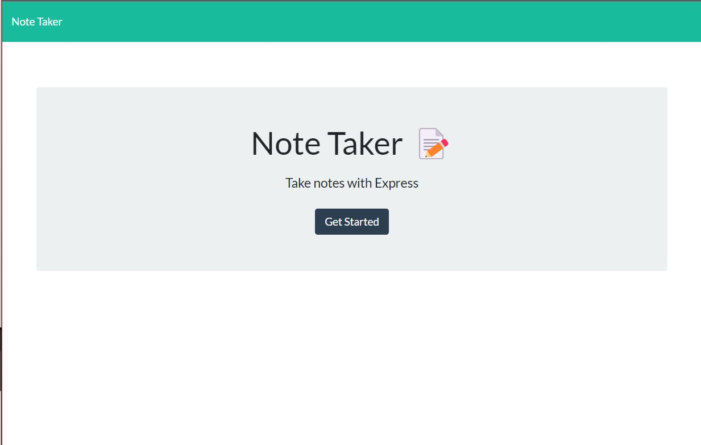
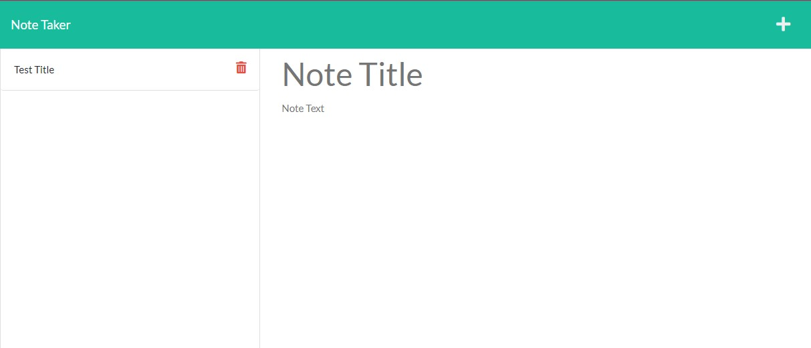
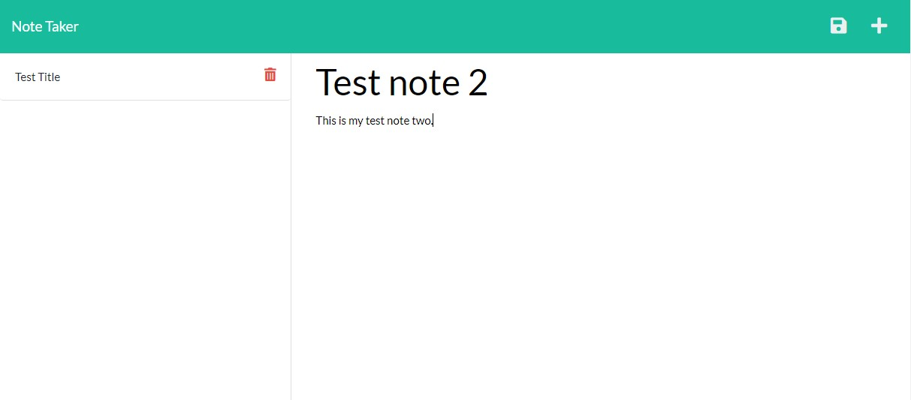
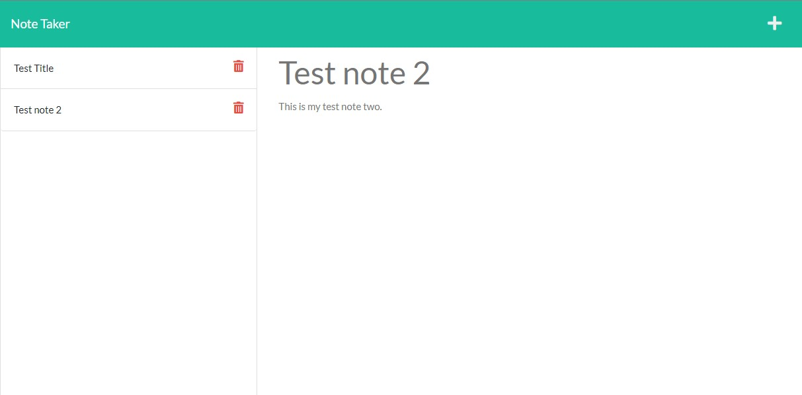
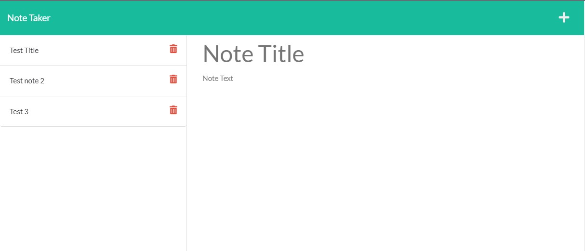

# Note Taker Application

There is no licence
## Description:
<blockquote>

A simple application deployed by heroku that can be used to writeand save notes.

</blockquote>

## Table of Contents
- [Description](#description)
- [Instructions](#instructions)
- [Contributions](#contributors)
- [Test Instructions](#testing)
- [Images](#images)
- [Contact](#questions)
- [license](#license)

## Instructions:

You can run this application by going to through this link : https://note-taker-heroku-1.herokuapp.com/

-Type your intended notes into the application 
-A save button will appear in the top right hand corner upon finishing entry. 
-Click the save button to save your file to the applciation.

## Contributors:

Ambrose Shokunbi

## Testing:

N/A

## Images

## Questions:
[Github](https://github.com/ashokunb)
 
Email: shokunbitobi@gmail.com

## License:

  This application is covered under no license
 
